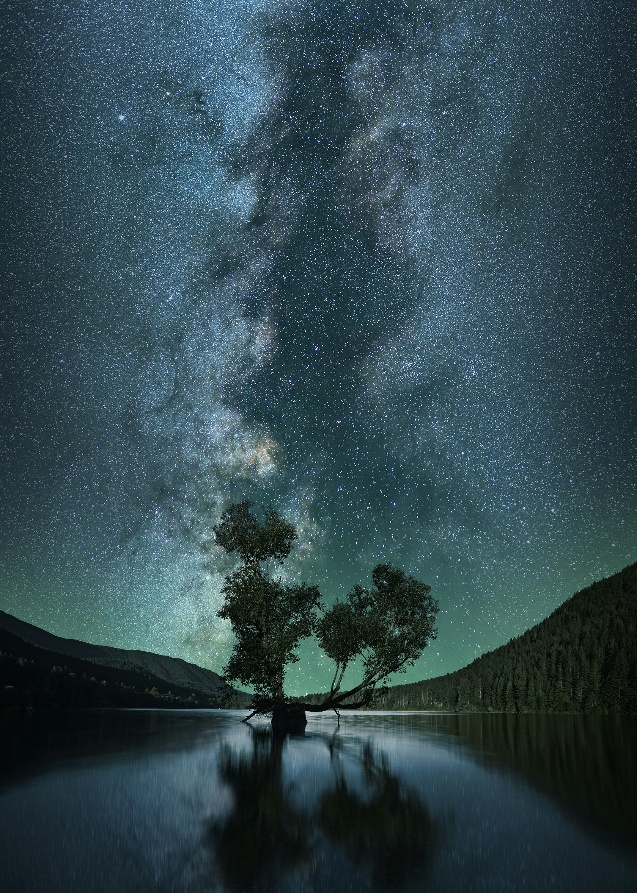

This project involves building a custom equatorial mount, which is essential for capturing long-exposure shots of the Milky Way and other celestial objects. An equatorial mount helps to counteract the Earth's rotation, allowing the camera to track stars precisely and avoid star trails in long exposures. This is particularly crucial for astrophotographers aiming to capture the night sky with clarity and detail.

As an embedded systems project, it combines mechanical design with electronic control. The mount will be powered by stepper motors and controlled via a microcontroller, ensuring smooth tracking of celestial objects across the sky.
<!--more-->
